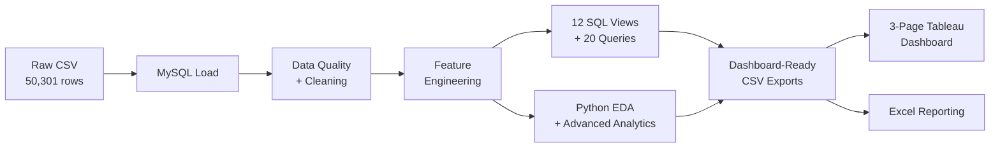

# Retail Inventory Optimization & Supply Chain Performance Analytics

### End-to-End Data Analytics Project — Python · SQL · Tableau · Excel

An analytics project built on 50,000+ retail transactions to flag stockouts, cut down dead stock, and rank suppliers on reliability.


---

## Executive Summary

Built a retail analytics solution for a simulated multi-store chain (25 stores, 8 warehouses, 20 suppliers, 410 SKUs, 4 years of data) to answer four questions the business couldn't answer with confidence before:

1. Which products, stores, and suppliers actually drive the P&L?
2. Where is working capital getting trapped in slow-moving stock?
3. How much revenue is being lost to stockouts, and why?
4. What should be reordered today, store by store?

The pipeline (Raw CSV → MySQL → Python → Tableau) produced 12 analytical SQL views, 20 business queries, an 8-metric KPI layer, and a 3-page executive Tableau dashboard, turning 48,991 cleaned records into concrete, rupee-quantified actions.

---

## Business Problem

A multi-store retail chain operating across 25 Indian cities, 8 regional warehouses, and 20 domestic + international suppliers was struggling with:

| Pain Point | Business Cost |
|---|---|
| Frequent stockouts on high-demand SKUs | Lost sales, poor customer experience |
| Excess & slow-moving inventory | Working capital blocked, high carrying cost |
| Supplier delivery delays (0.48 – 4.06 days) | Broken replenishment cycles |
| No single source of truth for KPIs | Ad-hoc buying, no data-driven reorder policy |

**Objective:** Build a data-driven analytics layer that measures performance, exposes root causes, and produces store-level reorder recommendations.

---

## Business Impact — What This Project Delivered

| # | Deliverable | Quantified Impact |
|:-:|---|---|
| 1 | Revenue concentration mapped | Electronics + Furniture = ~65% of total revenue (₹120.7 Cr of ₹184.7 Cr); enables focused inventory investment |
| 2 | ABC / Pareto classification | 82 SKUs (20%) = Class A driving ~80% of revenue → prioritized reorder policy on the vital few |
| 3 | Root cause of stockouts proven | Stockout rate goes from 0.02% (0–1 day delay) to 4.55–6.51% (2+ day delay) — supplier delay is the driver, not demand spikes |
| 4 | Supplier scorecard built | Best: SUP03 Prime Vendors Ltd (0.48-day delay, 91.17% on-time). Worst: SUP17 Oceanic Import-Export (4.06-day delay) — direct renegotiation shortlist |
| 5 | Reorder engine | 615 store-product combinations flagged for immediate reorder; 36 SKUs currently out of stock surfaced automatically |
| 6 | Working capital optimization | Slow-moving stock (turnover < 5) flagged for liquidation; Warehouse W08 flagged as 0% utilized (idle capital) |
| 7 | Executive KPI visibility | 3-page Tableau dashboard replaces manual Excel reporting — Total Revenue, Stockout %, Fill Rate %, Turnover in one view |
| 8 | Growth & seasonality unlocked | Q4 confirmed as peak quarter across all 4 years → basis for peak-season stocking policy |

**Bottom line:** Ad-hoc, gut-driven inventory decisions were replaced with a repeatable, KPI-backed reorder and supplier-management framework.

---

## Dataset at a Glance

| Component | Count | Description |
|---|---|---|
| Fact rows (raw) | 50,301 | Daily store × product sales & inventory records |
| Fact rows (cleaned) | 48,991 | After dedup, outlier handling, imputation |
| Products | 410 | Across 11 categories (Electronics, Furniture, Sports, Kitchen, Home Decor, Pet Supplies, Clothing, Beauty, Toys, Stationery, Groceries) |
| Stores | 25 | Metro, Tier-1, Tier-2, Flagship, Mall Outlet across India |
| Warehouses | 8 | Regional distribution centers |
| Suppliers | 20 | Domestic + International |
| Time Period | 4 Years | Jan 2021 – Dec 2024 |

---

## Tech Stack

| Layer | Tools |
|---|---|
| Language | Python 3.9+, SQL |
| Data Wrangling | Pandas, NumPy |
| Statistics | SciPy (t-test), Correlation analysis |
| Visualization | Matplotlib, Tableau, Excel |
| Database | MySQL 8.0+, SQLAlchemy, PyMySQL |
| Notebook | Jupyter |
| Version Control | Git, GitHub |

---

## Analytics Workflow



**Pipeline in one line:** `Raw CSV → MySQL → Cleaned & Modeled → SQL Views + Python Analytics → Tableau/Excel Dashboards`

---

## Analytical Methods Applied

| Method | Purpose | Tool |
|---|---|---|
| Data Quality Assessment | Missing / duplicate / outlier detection | Python |
| Data Cleaning Pipeline | Date parsing, text normalization, imputation | Python |
| KPI Calculation | Revenue, Profit, Turnover, Fill Rate, Stockout % | Python + SQL |
| ABC / Pareto Classification | Identify the vital few (80/20) | Python + SQL |
| XYZ Classification | Demand variability via Coefficient of Variation | Python |
| Inventory Turnover Analysis | Fast / slow / dead movers | Python + SQL |
| Trend Analysis | Monthly, QoQ, YoY (window functions) | Python + SQL (LAG) |
| Correlation Analysis | Delivery delay ↔ Stockout | Python + SQL |
| Hypothesis Testing | t-test for promo revenue lift | SciPy |
| Root Cause Analysis | Delay → Stockout → Revenue loss chain | Python + SQL |
| Rule-based Recommendation Engine | Store-product level reorder urgency | Python + SQL |
| Stockout Revenue Impact | Estimated ₹ lost per SKU | Python |

---

## 12 SQL Analytical Views

| View | Description |
|---|---|
| `vw_inventory_turnover` | Product-level turnover ratio |
| `vw_dead_stock` | Products with turnover < 0.5 |
| `vw_stockout_overstock` | Product-store stockout / overstock rates |
| `vw_supplier_performance` | Supplier scorecard (delay, fill rate, rank) |
| `vw_regional_performance` | City-level revenue ranking |
| `vw_warehouse_performance` | Warehouse utilization & stockouts |
| `vw_reorder_recommendation` | Products needing reorder (inventory vs reorder point) |
| `vw_monthly_kpi_summary` | Monthly revenue, units, stockout %, fill rate % |
| `vw_abc_classification` | Pareto-based ABC classification |
| `vw_store_ranking` | Store ranking by revenue & stockout |
| `vw_category_kpi` | Category-level KPI summary |
| `vw_quarterly_growth` | QoQ + YoY growth via `LAG()` window function |

## 20 Business Queries (SQL)

- **Q1 – Q6, Core Analytics:** slow movers, worst supplier, top products, reorder alerts, promo lift, weather impact
- **Q7 – Q14, Advanced Window Functions:** `ROW_NUMBER` top-N per category, `DENSE_RANK` store ranking, running totals, moving averages, quarterly growth, composite supplier score, ABC summary, `NTILE` quartiles
- **Q15 – Q20, Supply Chain Deep-Dive:** delay-bucket vs stockout, dead-stock capital, store stockout ranking, category KPI, warehouse utilization, YoY yearly growth

---

## Tableau Dashboard — 3 Pages

Deliverable: `Tableau/Retail Inventory & Supply Chain Analytics.twb`

### Page 1 — Executive Overview
KPI cards (Total Revenue, Total Units Sold, Stockout Rate, Fill Rate) · monthly revenue trend · Revenue by Category · Stockout Rate by Category · Stockout Risk by City map · Quarterly Growth (QoQ / YoY) · ABC Classification.


### Page 2 — Inventory & Stock Management
KPI cards (Total Inventory Value, Total Stock on Hand, Avg Inventory Turnover, Out-of-Stock Items) · Inventory Turnover by Category · Monthly Units Sold Trend · store-product level Reorder Recommendations · Slow-Moving Products ranking.


### Page 3 — Supplier & Root-Cause Analysis
KPI cards (Avg Delivery Delay, Best Supplier, On-Time Delivery %, Fill Rate %) · On-Time Delivery % by Supplier · Top 10 Delivery Delay by Supplier · Top 7 Supplier Reliability Score · Supplier Risk Matrix (lead time vs on-time delivery). This page makes the delay → stockout root-cause story visible and the supplier renegotiation case clear.


### Key Tableau Calculated Fields
```
Profit Margin %    = SUM([Profit]) / SUM([Revenue]) * 100
Stockout Rate %    = SUM([Stockout Flag]) / COUNT([Stockout Flag]) * 100
Fill Rate %        = SUM([Units Received]) / SUM([Units Ordered]) * 100
Inventory Turnover = SUM([Units Sold]) / AVG([Inventory Level])
On-Time Delivery % = SUM(IF [Delivery Delay Days] <= 2 THEN 1 ELSE 0 END)
                     / COUNT([Delivery Delay Days]) * 100
YoY Growth %       = (SUM([Revenue]) - LOOKUP(SUM([Revenue]), -12))
                     / LOOKUP(SUM([Revenue]), -12) * 100
```

---

## Top 10 Headline Insights

1. **Electronics is the #1 category** — ₹76.27 Cr revenue, 41.3% of total.
2. **Furniture is #2** — ₹44.42 Cr, 24.0%; top-2 categories = ~65% of revenue.
3. **ABC split:** 82 products (20%) are Class A driving ~80% of revenue; 149 Class B; 179 Class C.
4. **Best supplier — SUP03 Prime Vendors Ltd:** 0.48-day avg delay, 91.17% on-time, reliability score 96.
5. **Worst supplier — SUP17 Oceanic Import-Export:** 4.06-day avg delay, 30-day contracted lead time.
6. **Delay is a proven stockout driver** — 0.02% stockout at 0–1 day delay vs 4.55–6.51% at 2+ day delay.
7. **Top revenue city: Guwahati** — ₹13.10 Cr. **Highest stockout risk city: Bhopal** — 1.26%.
8. **Seasonality confirmed** — Q4 is peak revenue quarter across all 4 years.
9. **Warehouse W08 idle** — 0% utilization, 0 revenue → investigation flagged.
10. **36 SKUs out of stock right now**; 615 store-product combinations flagged for reorder.

---

## Project Structure

```
Retail Inventory & Supply Chain Performance Analytics/
│
├── data/                                    # Raw + processed CSVs
│   ├── fact_sales_inventory_RAW.csv             (50,301 rows — raw)
│   ├── fact_sales_inventory_CLEANED.csv         (48,991 rows — cleaned)
│   ├── fact_sales_inventory_analytics.csv       (analytics-ready)
│   ├── products.csv                             (410 products, 11 categories)
│   ├── stores.csv                               (25 stores)
│   ├── suppliers.csv                            (20 suppliers)
│   └── warehouses.csv                           (8 warehouses)
│
├── SQL/                                     # MySQL scripts
│   ├── schema.sql                               (DB schema — MySQL 8.0+)
│   ├── views.sql                                (12 analytical views)
│   └── business_queries.sql                     (20 business queries)
│
├── SQL_data/                                # SQL view exports (source of truth for dashboards)
├── Clean Data/                              # Notebook-generated dashboard exports
│
├── Tableau/
│   └── Retail Inventory & Supply Chain Analytics.twb   (3-page dashboard)
│
├── Tableau Screenshots/                     # PNGs of all 3 dashboard pages
│
├── Mysql_data_loader.py                     # CSV → MySQL loader
├── export_datasets.py                       # SQL views → CSV exporter
├── Retail_Inventory_Analytics.ipynb         # Main Jupyter notebook
├── requirements.txt
├── .env.example                             # Template (no real secrets)
├── .gitignore
└── README.md
```

---

## How to Run This Project

### Prerequisites
- Python 3.9+
- MySQL 8.0+
- pip

### 1. Install dependencies
```bash
pip install -r requirements.txt
```

### 2. Create the database
```sql
source SQL/schema.sql;
```

### 3. Configure DB credentials securely
```bash
# Copy the template and fill in your password
cp .env.example .env
# then edit .env → DB_PASSWORD=your_mysql_password
# .env is gitignored and never committed.
```

Alternative — shell environment variable:
```bash
# macOS / Linux
export DB_PASSWORD="your_mysql_password"
# Windows PowerShell
$env:DB_PASSWORD = "your_mysql_password"
```

### 4. Load data into MySQL
```bash
python Mysql_data_loader.py
```

### 5. Build views & run business queries
```sql
source SQL/views.sql;
source SQL/business_queries.sql;
```

### 6. Export SQL results to CSV
```bash
python export_datasets.py
```

### 7. Run the Jupyter notebook
```bash
jupyter notebook Retail_Inventory_Analytics.ipynb
```

### 8. Open the Tableau dashboard
Open `Tableau/Retail Inventory & Supply Chain Analytics.twb` in Tableau Desktop and refresh with either the CSVs in `Clean Data/` or the live MySQL views.

---

## Key KPIs Delivered

| KPI | Formula | Business Use |
|---|---|---|
| Total Revenue | Σ (Units Sold × Unit Price) | Top-line performance |
| Profit Margin % | Profit / Revenue × 100 | Profitability by product / category |
| Inventory Turnover | Units Sold / Avg Inventory | Fast vs slow movers |
| Stockout Rate % | Stockout Flags / Total Records × 100 | Service-level risk |
| Fill Rate % | Units Received / Units Ordered × 100 | Supplier reliability |
| On-Time Delivery % | Deliveries ≤ 2 days / Total × 100 | Supplier scorecard |
| YoY / QoQ Growth % | LAG window function | Trend & seasonality |
| Reorder Urgency | Reorder Point − On-Hand Inventory | Operational reorder trigger |

---

## Skills Demonstrated

**Data Engineering** — CSV → MySQL ETL, SQLAlchemy, schema design, data quality pipeline

**SQL** — Window functions (`LAG`, `ROW_NUMBER`, `DENSE_RANK`, `NTILE`), views, CTEs, composite scoring

**Python Analytics** — Pandas, NumPy, SciPy hypothesis testing, correlation, feature engineering

**Business Analytics** — ABC/XYZ, Pareto, root cause analysis, rule-based recommendation engine

**Visualization** — Tableau (3-page dashboard), Matplotlib, Excel pivots & slicers

**Communication** — Executive-ready storytelling, business impact framing, actionable recommendations

---

## Assumptions & Limitations

**Assumptions**
- Profit computed using `unit_cost` from the product dimension.
- Stockout revenue loss estimated from historical daily-average sales.
- Reorder engine is rule-based (reorder point vs on-hand inventory), evaluated per store-product.
- ABC split = 80 / 15 / 5 revenue thresholds; XYZ CV thresholds = 0.5 and 1.0.
- "Slow-moving" on the dashboard uses turnover < 5 as a practical cut (the stricter < 0.5 dead-stock threshold returned zero SKUs on this dataset).

**Limitations**
- Historical dataset — no forward-looking demand forecast (rule-based, not ML).
- No customer-level transaction detail.
- Transportation, FX, and warehouse operating costs excluded.
- Weather / season effects are observational, not causal.

---

## Future Enhancements

- Add ARIMA / Prophet demand forecasting layer for predictive reordering
- Safety-stock optimization using demand variability (XYZ) + supplier lead time
- Real-time streaming ingestion (Kafka / Airflow) for daily refresh
- Customer-level RFM / cohort analytics
- Push dashboards to Tableau Public / Power BI Service for shareable executive access

---

## requirements.txt

```
pandas>=2.0.0
numpy>=1.24.0
matplotlib>=3.7.0
scipy>=1.10.0
sqlalchemy>=2.0.0
pymysql>=1.1.0
jupyter>=1.0.0
```

---

## About the Author

**Sumersing Patil** — Data Analyst

Turning messy business data into decisions using SQL, Python, and Tableau.

Open to Data Analyst roles — feel free to reach out for feedback, opportunities, or collaboration.

---
